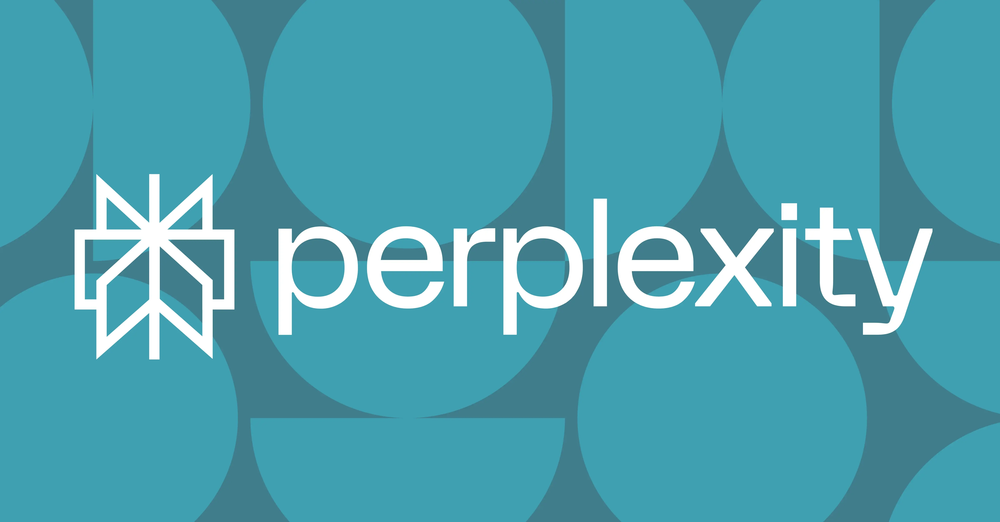

# Perplexity AI是什么?一个能给出靠谱答案的搜索工具

---

你有没有遇到过这种情况:在搜索引擎里输入一个问题,结果打开了十几个网页,看了半天还是云里雾里。或者问ChatGPT,它说得头头是道,但你不知道这些信息是真是假。

Perplexity AI就是为了解决这个痛点而生的。它不会给你一堆链接让你自己翻,也不会空口白话不给出处。它直接告诉你答案,还把信息来源标得清清楚楚——你可以自己点进去验证。

这篇文章会告诉你:Perplexity到底是什么、怎么用、和ChatGPT有什么区别、适合哪些场景,以及它有哪些局限性。如果你正在找一个既快又靠谱的AI搜索工具,接着往下看就对了。

---

## Perplexity AI是个什么东西?

简单说,Perplexity AI是一个"会说话的搜索引擎"。

你问它问题,它不会像百度或Google那样甩给你一堆链接,而是直接给你一个清晰的答案,并且把信息来源标注出来。你可以点开这些来源,看看它到底是从哪儿找到的这些内容。

这个工具2022年上线,很快就在研究人员、职场人士和普通用户中火了起来。原因很简单:它能理解你的问题,快速整理信息,还给你可靠的出处。整个过程就像和一个懂行的朋友聊天,但这个"朋友"的回答是有根据的。

说白了,Perplexity想做的事情就是:让你既能享受AI对话的便利,又能信任它给出的信息。

## Perplexity能干什么?

Perplexity的功能可以理解为"搜索引擎+研究助手+引用生成器"的组合体。具体来说:

- **回答复杂问题**:不管你问的是科学理论、时事新闻还是冷门知识,它都能给你一个清晰的答案。

- **标明信息来源**:每个答案都会附上原始内容的链接,你可以自己去核实。

- **总结信息**:它不只是扫描多个网页,还会把关键信息提炼出来,给你一个简洁的摘要。

- **支持追问**:你可以接着问"能解释得更简单点吗?"或者"有没有相反的观点?",它会记住你之前问的内容,继续对话。

- **多模式搜索**(部分版本):高级版本里,Perplexity还能处理图片或代码输入,不只是文字。

总之,它的目标就是让高质量信息变得更容易获取、更好理解、更透明——不管你是快速查个东西,还是深入研究一个复杂话题。

### Perplexity的几个亮点功能

- **实时搜索**:答案来自最新的网络数据,不是过时的训练模型。

- **每个回答都有引用**:你能看到信息从哪儿来的,方便验证。

- **记住上下文**:追问的时候,它会记得你之前问了什么。

- **多模式支持**(限定版本):有些版本可以分析图片或代码片段。

- **不用注册也能用**:虽然注册账号能解锁更多功能,但不注册也能正常使用。

- **界面简洁快速**:搜索框式的布局,提问、看结果、查来源都很方便。

- **新推出的iOS语音助手**:2025年4月,Perplexity发布了苹果设备的语音助手,可以用语音完成发邮件、订房间等任务。

## Perplexity适合用在哪些场景?

Perplexity不只是个聊天机器人,它更像是一个"高信任度的研究工具"。不管你是写论文、做竞品分析,还是和朋友争论某个问题,它都能派上用场。

### 学术研究

对学生和研究人员来说,Perplexity特别好用。它内置的引用追踪功能,能让你快速找到可靠来源——比如学术期刊、新闻媒体、数据库。你不用手动翻几十篇论文,直接问一个复杂问题,就能得到带引用的总结性答案,省下大把时间。

常见用法:
- 文献综述
- 了解最新研究
- 总结复杂的学术概念
- 快速对比不同观点

### 职场应用

在工作场景里,Perplexity能帮你节省不少时间。各行各业的人都在用它:

- 做市场调研
- 了解行业趋势
- 回答技术或法律问题
- 总结长篇报告或文章

因为它给出的答案都有来源链接,所以在需要准确性和可验证性的岗位上特别有用——比如咨询、法律研究或企业支持。

### 日常学习和个人知识

对普通用户来说,Perplexity是个比传统搜索引擎更聪明的选择。想快速了解量子力学?好奇某个地缘政治冲突的历史?想知道某种饮食趋势的利弊?直接问,它会给你一个易读、来源清晰的摘要。

特别适合:
- 喜欢不断学习新东西的人
- 帮孩子做作业的家长
- 爱问难题、追求知识的人
- 想快速做出明智决定的人(比如:"燕麦奶比杏仁奶更健康吗?")

👉 [想了解更多Perplexity如何提升你的研究效率?点这里](https://pplx.ai/ixkwood69619635)

## Perplexity是怎么工作的?

Perplexity结合了聊天机器人的对话界面和搜索引擎的数据查询能力。它的核心是先进的自然语言处理(NLP)、实时搜索能力,以及不断优化回答的机器学习算法。

### 自然语言处理和机器学习

Perplexity的核心是一个复杂的NLP系统,能像人一样理解你的问题。它不只是查找关键词,还能理解意图、措辞和上下文,从而给出准确的回答。

### 数据来源整合和引用追踪

和大多数AI聊天机器人不同,Perplexity建立在透明度的基础上。它从整个网络实时获取数据,并展示答案的来源——通常是学术论文、新闻来源或可信网站的链接。

### 实时搜索和更新

Perplexity不依赖静态的训练数据集。它实时搜索网络,这意味着它能对当前事件、新发表的研究和热门话题给出最新回答。

### 工作流程(一步步拆解)

以下是Perplexity提供答案的快速流程:

1. **你提出一个问题**,用自然语言。
2. **Perplexity解析查询**,用NLP理解意图和上下文。
3. **它进行实时网页搜索**,跨多个可信来源。
4. **相关内容被分析**,用机器学习识别最准确、最简洁的信息。
5. **生成答案**,包含对原始来源的引用。

整个过程只需几秒钟——结果是快速、清晰且可验证的回答。

## 怎么用Perplexity AI?

Perplexity的设计很直观,但要充分利用它,不只是输入问题那么简单。以下是开始使用、写出更好提示、以及评估回答的方法。

### 使用Perplexity AI的分步指南

用Perplexity很简单——但用对方法,能让它更有效。按照这些步骤开始,最大化它的功能。

**第一步:访问网站或下载应用**

在桌面浏览器中前往www.perplexity.ai,或从Apple应用商店或Google Play下载Perplexity AI应用。

*小贴士:移动应用和桌面体验一致,所以你可以轻松在设备之间切换。*

**第二步:开始输入你的问题**

在搜索框中,输入一个清晰具体的问题。Perplexity支持自然语言,所以你可以像和人聊天一样提问。

例子:
好的:"东南亚气候变化对经济的影响是什么?"
不好:"气候变化?"

**第三步:提交你的查询**

按Enter键或点击发送图标。几秒内,Perplexity会生成答案,并附上来源的引用。

你会看到支持文章和数据的链接,通常来自学术出版物、新闻机构或可信网站。

**第四步:探索来源**

点击上标号或嵌入链接查看原始来源。这在以下情况特别有用:验证事实、深入了解细节、评估信息质量。

**第五步:用追问问题进行细化**

Perplexity支持连续追问。你可以问:

- "能用更简单的词解释吗?"
- "有哪些相反的观点?"
- "是谁说的?"

它会保留你原始问题的上下文,提供更细致的回答。

**第六步:注册获得额外功能(可选)**

虽然你可以免费使用Perplexity,但创建账号能解锁:

- 聊天记录
- 保存的对话
- 个性化结果
- 访问专业功能(如高级模型和优先响应)

### 写出更好查询的技巧

Perplexity能处理随意的、人性化的问题,但稍微结构化能事半功倍。以下是如何写出更好提示的方法:

- **具体明确**:不要问"什么是气候变化?",改为"根据最近的联合国报告,气候变化的主要原因是什么?"

- **包含时间框架或地点**(如果相关):试试"2025年最大的网络安全威胁是什么?"或"德国现在的职场环境如何?"

- **使用追问**深入了解——Perplexity会保持上一个查询的上下文。

例子:
- "2024年Adobe的头号竞争对手是谁?"
- "概述最新的WHO心理健康报告"
- "ChatGPT和Perplexity的事实准确性有何比较?"

### 如何验证来源并解读结果

Perplexity在提供每个回答时都包含引用。通常会看到编号上标或可点击链接,指向:

- **新闻媒体**(如BBC、路透社)
- **科学期刊**(通过Semantic Scholar、PubMed等)
- **维基百科**(谨慎使用,通常需交叉验证)

验证Perplexity答案时要注意:

- **可靠的域名**,如.gov、.edu或知名媒体
- **最近发布的**文章(适用于时效性查询)
- **多个来源**支持单个答案(这是个好迹象)

如果你在严肃的事情上使用Perplexity,比如研究或客户工作,最好的习惯是打开这些来源再次检查信息。

## Perplexity AI vs ChatGPT

Perplexity AI和ChatGPT都是基于强大语言模型的先进工具,但它们用途不同——根据你想做什么,一个可能比另一个更合适。

以下是它们的对比。

### 功能和重点的主要区别

**主要用途**
- *Perplexity AI*:设计用于搜索、查找事实和研究。
- *ChatGPT*:专注于对话、头脑风暴和内容生成。

**带来源的答案**
- *Perplexity AI*:答案中始终直接引用来源。
- *ChatGPT*:默认不包含引用,除非你使用启用网页浏览功能的专业版。

**上下文保留**
- *Perplexity AI*:在当前问题串中保持上下文。
- *ChatGPT*:在对话格式中保留持续上下文,更适合长时间对话。

**实时搜索**
- *Perplexity AI*:默认包含实时搜索。
- *ChatGPT*:仅GPT-4 Pro版本支持实时搜索。

**免费版本功能**
- *Perplexity AI*:免费提供实时搜索和引用。
- *ChatGPT*:免费版使用GPT-3.5,功能有限,无实时搜索。

**界面风格**
- *Perplexity AI*:更像搜索引擎——简明且有来源支持。
- *ChatGPT*:在聊天界面中提供更长、更具对话性的回答。

**简而言之:**

- 当准确性、透明度和来源很重要时——尤其是研究密集型或高风险问题时,用**Perplexity AI**。
- 当你需要生成内容、探索想法或进行更开放式对话时,用**ChatGPT**。

### 你应该选哪一个?

以下是一些场景,帮你做决定:

- **研究和事实查证** → 选**Perplexity AI**
- **写作协助和内容创作** → 选**ChatGPT**
- **用引用解释复杂议题** → **Perplexity AI**
- **创意思维和模拟对话** → **ChatGPT**
- **总结当前新闻或学术资源** → **Perplexity AI**,因为它来自实时数据

如果你在ChatGPT Pro中使用GPT-4,这两个工具之间的界线开始模糊——特别是启用了浏览功能。即便如此,Perplexity的内置来源和简化界面使它成为快速、可信赖答案的首选。

## 谁拥有Perplexity AI?

Perplexity AI背后是一家快速成长的公司,迅速成为AI领域的重要玩家。从创始团队到投资方支持,这家机构正在推动产品发展,引发了许多关注和好奇心。

### Perplexity AI创始人和起源故事

Perplexity AI是由Aravind Srinivas、Denis Yarats、Johnny Ho和Andy Konwinski于2022年共同创立的。他们的目标是建立一个工具,将对话式AI与实时、有来源的搜索结果相结合——这是传统搜索引擎和聊天机器人当时都做不到的。

创始团队来自OpenAI、Meta和Palantir等公司,这为他们开发值得信赖、以研究为导向的AI产品奠定了坚实基础。

### Perplexity AI首席执行官

Aravind Srinivas是Perplexity AI的现任CEO。在共同创立公司之前,他曾在OpenAI担任研究科学家,并获得了加州大学伯克利分校计算机科学博士学位。在他的领导下,公司因其对透明度、用户信任和技术卓越的承诺迅速引起关注。

### Perplexity AI股票和融资

截至目前,**Perplexity AI是一家私人公司**,但已引起主要投资者的注意。该公司已从NEA、Elad Gil和Bessemer Venture Partners等知名机构获得了融资。

虽然目前没有Perplexity AI的股票面向公众,但公司的增长和媒体关注引发了关于潜在IPO的猜测。目前,其估值和财务状况仍然保密。

### 如何获取公司新闻的最新信息

想关注Perplexity的增长或未来的投资机会?以下是保持了解的几种方式:

- 关注他们的官方博客和X/Twitter账号
- 在TechCrunch或Crunchbase上观察融资公告
- 订阅涵盖AI行业的新闻通讯

## 局限性和需要注意的地方

Perplexity AI功能强大,但像任何AI工具一样,它并不完美。如果你依赖它进行严肃研究、决策或公开内容,了解它的边界至关重要。

### 准确性和可靠性

Perplexity旨在提供带来源引用的事实回答,但这不意味着它免疫于错误。有时:

- 它可能误解复杂问题
- 来源可能过时、有偏见,或脱离上下文
- 总结的回答可能过于简化有细微差别的主题

**最佳实践:**始终点击原始来源,尤其是像医疗建议、法律细节或财务指南等关键信息。

### 道德使用和透明度

Perplexity的一大优势在于它显示答案来自哪里。但道德上使用AI不只是引用那么简单。考虑:

- **来源材料中的偏见**:网络存在偏见,搜索结果也会受影响。
- **用户隐私**:始终查看平台的数据和隐私政策,了解收集了什么以及如何使用。
- **AI幻觉**:像大多数生成式AI工具一样,Perplexity有时可能自信地呈现不正确的信息。

Perplexity比许多工具更好地减少了这些风险,但用户仍应运用批判性思维——尤其在学术、专业或新闻工作中使用时。

---

## 总结:为什么Perplexity AI值得关注

Perplexity AI不只是个智能聊天机器人——它是一个为AI时代重新设计的搜索引擎。通过将实时网络搜索与对话回答和可验证的来源结合,它提供了大多数工具所不具备的东西:**你真正可以信任的答案**。

不管你是追逐引用的研究人员、寻求复杂数据的专业人士,还是只想快速获得准确答案的人,👉 [Perplexity都能为信息过载的混乱带来清晰](https://pplx.ai/ixkwood69619635)。

它独特的透明度、速度和易用性,使它成为生成式AI领域最有前景的工具之一——也是我们未来在搜索、学习和验证信息方面的有力竞争者。
